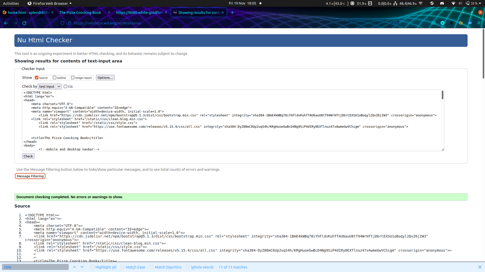
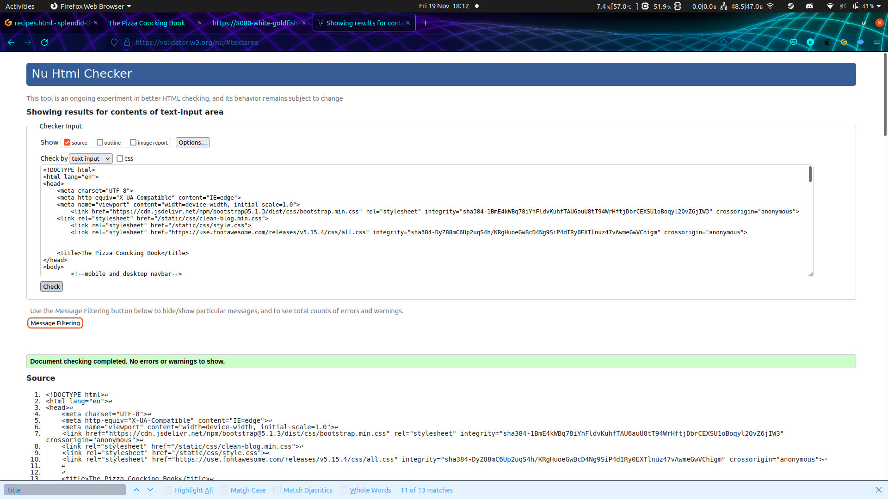
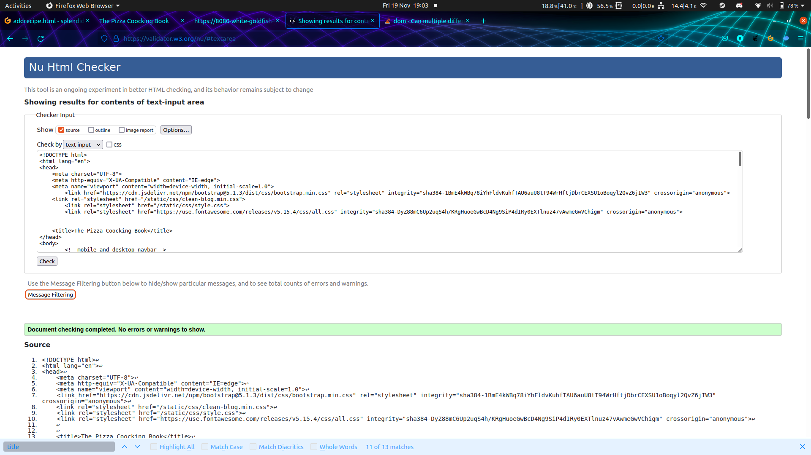
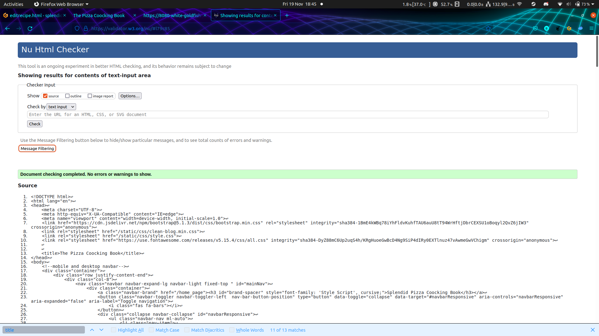
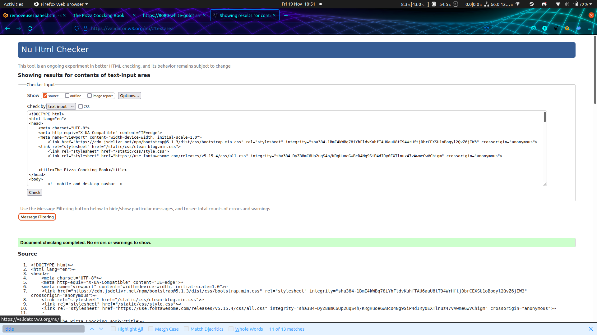
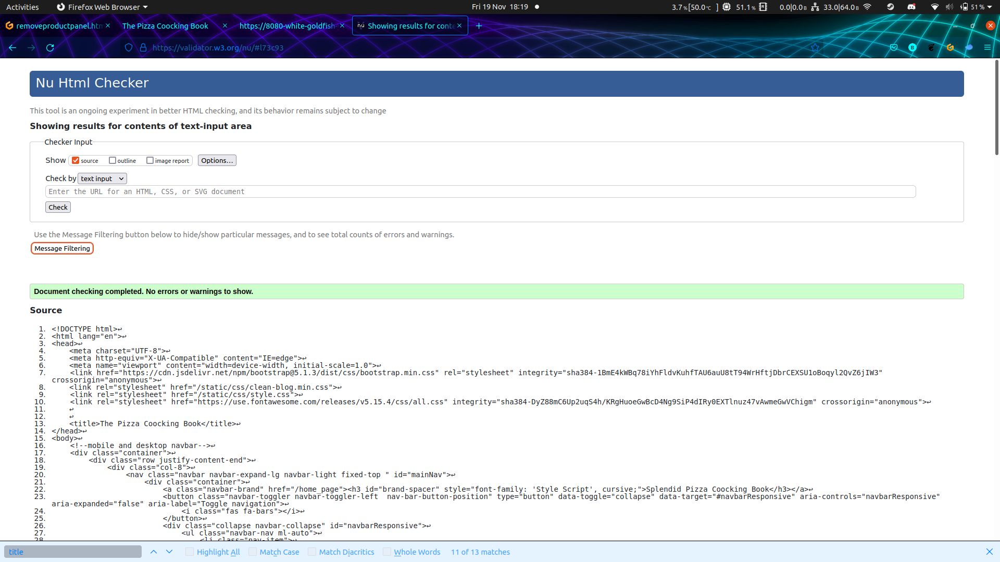
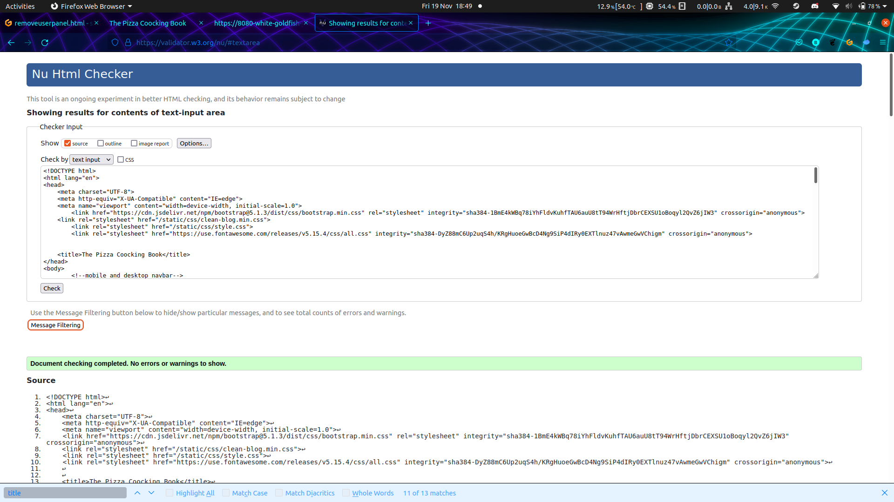
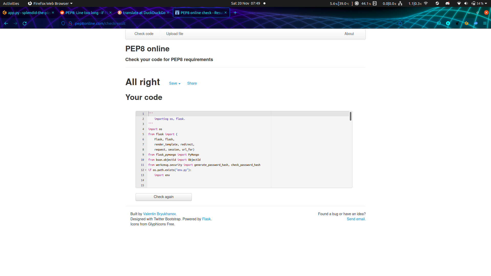
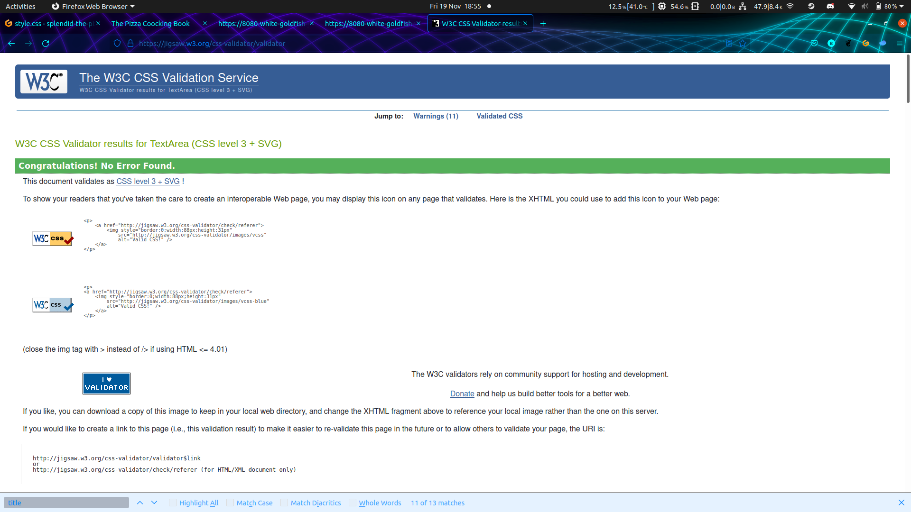
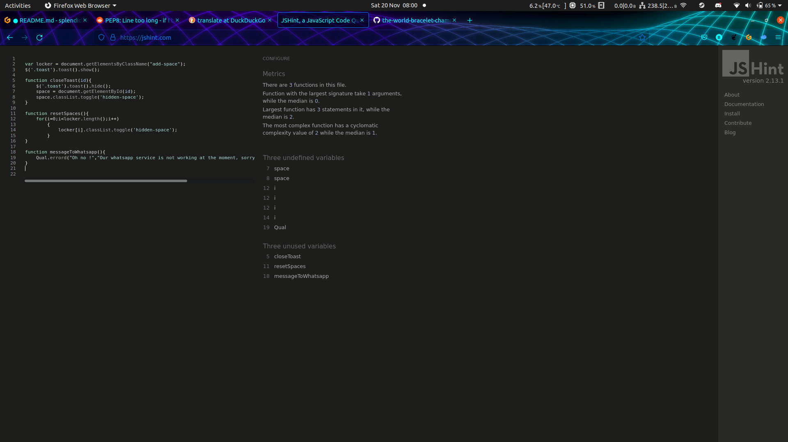

# UX: #

## **Strategy:** ## 

**Is the content culturally appropriate?** 

- Culturally speaking in the uk the italian food, and more the pizza have a big impact in the marrket, owrth 2.1billon pounds is the prove of a big love for this product. 

**Is the content relevant?** 

- The website its aimed for the pizza lovers, who want to not just make or take recipies from the cooking book, also they can share their own recipies to the pizza lovers comunity, and the access to a wide group of coocking tools to make it more easy 

**Can we track a catalogue the content in an intuitive way?**

- This website will be divide in sections to make it more intuitive and easy for the user, the main sections will be The coocking book itself, My recipies, a about us.

**Is the technology appropiate?** 

- Will be using html5, css and Js for all the user interface, and python,SQL for all the backend, the user interface will be full responsive to adapt to any device, but will be aimed for mobile devices 

**Comprany Goals.** 

- Because its a coocking ampliance company they love this art, the main goal is reach all the pizza comunity lovers and show them all the coocking tools avaible for the recipies, with this function make possible sell the product or make the brand known in the comunity 

**Users goals.** 

- The user goal is  find a new way to cook a pizza, share recipies, and enjoy new ones, share opinions about the differents recipies, and if its needed have the possibility to find the tool to make it perfect 
 
**What are the pros of what they're doing, and what are the cons?** 
- The pros of macking a coocking social media book, its the avility to make our brand more known, so its not just the people from the comunity searchins a recipie or sharing it, its about make our brand notice in every single recipie.
- The cons can be the posibility of the user to be more concentrate in the recipies than in the product itself, we can fix this with a good presens of the product in the recipie section.
	 
**What are they missing?** 
- They have videos, times, ingredients, and an explanation about every single step, but in any place they wrote wich tool you need to cook it, so in our website will be including this, and let the consumer know before they start what are the ingredient, tools and time necesary to make the recipie.
	 
**What are they doing, but they could be doing better?** 
- They can inprove the accesibility of the website, the competitor have videos made with background music without any instruction of what its happening in the video, wich is really limiting the audience of this video for the peaple who can see, they can add not just a video with music, we can add instructions, and a more detailed recipie for each of the steps.

## **Scope**

*	Taking the strategy now in the scope we can think in the main feactures of this website, making a good pizza cooking book, but at the same time make the brand be known by adds:

* **The main feactures**: the possibility of navigating between the following options to find quick as possible the information needed:
    * A home page, with information about our love for the pizza and show the pasion about it.
    * A recipe section with all the recipes by categories for quick access.
    * A data base of users, and recipes.
    * Adds about our products, but avoiding invasive adds.
    * An admin panel to upload product to a data base and administrate users,recipes and adds.

* **Full mobile device compatibility**: The inclusion of being able to navigate the site from any device, including access from a mobile.

* **Desired functions for the future**: 
    * Conection to a social media.
    * Conection to a whatsapp service for contact and the posibility to sell products
    * Implement multi-language options
    * Users can upload videos about their recipes.
    * The posibility to make a review about a recipe.

## **Structure**

In this section the basic structure will be outlined, and how the information will be presented.

*	**What a guest would like to see the first time:**
    * Recipes about pizzas
    * A quick way to see all recipes
    * A navbar with access to a profile (control panel) to an easy way to share recipies
    * A contact details, social media (if is a possible customer lookingfor cocking tools)

*	**How I present this information: The best way for me to present the info is to make the web site minimalistic.**

    * **Home:**
        * What we think about pizza and what the pizza is for us as a company and as a pizza lover.
        * A navbar with home, recipes, profile and about us, in whis page a quick access to a register and login section.
        * Recent Activities: This tile will be a list of the latest activities, such a study, progress of a project, new acquired skills, etc.
    * **Recipes:**
        * A list of recipes with description.
        * A menu, with all categories, to filter this recipes.
        * Every single recipe will have a button to view the recipe with all the steps, tools, and description
    * **About Us:**
        * History of the company.
        * Why we love pizza, and where this company come from.
    * **Profile**
        * For all user a profile panel with the hability to add, delete and edit recipes, for the admin user, add, edit and delete recipes, add or delete offers and delete users.

        
/////////////////////////// pegar imagen del diagrama /////////////////////////////////

## **Skeleton**

I start doing draws about this project, and how will present the structure in the futures wireframes, below you can see each link is a really rudimentary draw of the diferet sections

This is a direct link to try the wireframes, also below this link you can find images of every single wireframe made for this project:

_Live Wireframes to try:_
[Try Me](https://balsamiq.cloud/shar9rt/pap1kxl/r2278?f=N4IgUiBcCMA0IDkpxAYWfAMhkAhHAsjgFo4DSUA2gLoC%2BQA%3D)

_Links of all the individual wireframes:_

Home page:
- [Home Desktop View](/README-FILES/images/wireframes/desktop/home-desktop.jpg)
- [Home Mobile View](/README-FILES/images/wireframes/mobile/home-mobile.jpg)

Recipes page:
- [Recipes page Desktop View](/README-FILES/images/wireframes/desktop/recipes-desktop.jpg)
- [Recipes page Mobile View](/README-FILES/images/wireframes/mobile/recipes-mobile.jpg)

Recipes View page:
- [Add Recipes page Desktop View](/README-FILES/images/wireframes/desktop/recipe-view-desktop.jpg)
- [Add Recipes page Mobile View](/README-FILES/images/wireframes/mobile/recipes-view-mobile.jpg)

Profile (User) page:
- [Contact Desktop View](/README-FILES/images/wireframes/desktop/recipe-manager-desktop.jpg)
- [Contact Mobile View](/README-FILES/images/wireframes/mobile/recipe-manager-mobile.jpg)

Profile (ADMIN) page:
- [Profile adds (ADMIN) Desktop View](/README-FILES/images/wireframes/desktop/admin-panel-ads-adder-modifier-desktop.jpg)
- [Profile adds (ADMIN) Mobile View](/README-FILES/images/wireframes/mobile/admin-panel-ads-modifier-mobile.jpg)
- [Profile adds edit(ADMIN) Desktop View](/README-FILES/images/wireframes/desktop/admin-panel-ads-desktop.jpg)
- [Profile adds edit(ADMIN) Mobile View](/README-FILES/images/wireframes/mobile/admin-panel-ads-mobile.jpg)
- [Profile panel mod(ADMIN) Desktop View](/README-FILES/images/wireframes/desktop/admin-panel-desktop.jpg)
- [Profile panel mod(ADMIN) Mobile View](/README-FILES/images/wireframes/mobile/admin-panel-mobile.jpg)

SignUp page:
- [SignUp page Desktop View](/README-FILES/images/wireframes/desktop/signup-desktop.jpg)
- [SignUp page Mobile View](/README-FILES/images/wireframes/mobile/signup-mobile.jpg)

Login page:
- [Login page Desktop View](/README-FILES/images/wireframes/desktop/login-desktop.jpg)
- [Login page Mobile View](/README-FILES/images/wireframes/mobile/login-mobile.jpg)

## **Surface**

In this section i start looking for a good palet color, this color must to be in conjuntion with the pizza themes 

Transmit the love for the pizzas is the most important thing, plus we need to show adds to make the products appear in the website.

Before start coding the index, I did a research about what are the most common mobile and pc resolution around the world.

The most common mobile resolution is:

Resolution | Mobile percentage
------------ | -------------
360x640  | 10.77%
414x896 | 7.37%
360x780 | 5.9%
375x667 | 5.56%
360x800 | 5.52% 
360x760 | 5.15% 

Data taken from _[statcounter](https://gs.statcounter.com/screen-resolution-stats/mobile/worldwide)_

For desktop screen resolution the numbers are different

Resolution | Desktop porcentage
------------ | -------------
1920x1080  | 20.99%
1366x768 | 20.23%
1536x864 | 9.72%
1440x900 | 6.23%
1280x720 | 5.45%
1600x900 | 3.47%

Between the 1080px and 768px resolution we have almost the 50% of the users, if we add 768px, 864px and 900p we have more than 60% of the users.

### *Navbar**

The main navbar change, its not the same always, so we have:

- The navbar when the user is not login:

- The navbar when the user is login:

- The navbar when the user is login as a administrator:

### **Middle Section**

The middle section depending of the template rendered are:

- Home page with some nice carousel made with bootstrap inviting the user to visit the recipes section:

- The recipe section where the user can filter the recipes and view all the avaibles recipes loadeds in the db:

- The login section:

- The register section:

- The profile section where the user can add recipes, delete and edit it.

- The admin panel (for admin users):

- The add offer, remove offer, remove user. Add, delete and edit recipes section:

- Image of the completed web site:
    
    
    

### **The footer**

The footer is made with the social media in mind, but in a really minimalistic way:

# **Testing**

## **Responsive**
    
The site it has made to be responsive for all devices:
    
* Image of the mobile web site: 
   
   
    
    
* Image to show the responsive design in the web site: 
   
   
    

## **Validators**

* I did the validation for every single page, this are the result:
    
    - Home validation: 
    
    

    - Recipes validation: 
    
    

    - About us validation: 
    
    

    - Add recipe (first step) validation: 
    
    

    - Add recipe second page validation: 
    
    

    - Admin panel validation: 
    
    

    - Edit recipe validation: 
    
    

    - Login page validation: 
    
    

    - Offer adder validation: 
    
    

    - Offer remover validation: 
    
    

    - Profile admin validation: 
    
    

    - Register page validation: 
    
    

    - Remover user panel validation: 
    
    

* PIP8 validation

    - PIP8 result:

    

* CSS validation

    -Css validation result:

    

* JSHint validation

    -JS validation result:

    

	 
## **Testing Web Site**

* Home:
    - Tested:
        1) Navbar (all links tested).
        2) All buttons: position, size, all correct.
        3) Carousel working

* Recipes:
        1) Navbar (all links tested).
        2) All buttons: position, size, all correct acordion and view.

* About Us (user):
    - Tested:
        1) Navbar (all links tested).
        2) All buttons: position, size, all correct.

* Profile (user and admin):
    - Tested:
        1) Navbar (all links tested).
        2) All buttons: position, size, all correct, acordion and edit,delete, view and add recipe working.

* Add, delete, edit recipes (user and admin):
    - Tested:
        1) Navbar (all links tested).
        2) All buttons: position, size, all correct.

* Delete users, offers and add offers (admin):
    - Tested:
        1) Navbar (all links tested).
        2) All buttons: position, size, all correct.

* View recipe (user and admin):
    - Tested:
        1) Navbar (all links tested).
        2) All buttons: position, size, all correct.

## **Unfixed Bugs**

* I did not find any errors, the website was tested on the following devices:
    - Samsung s9+ (Android) Ver. 
        - Web Browser: 
            - Chrome: Versión 96.0.4664.45
    - Iphone 12 Pro (IOS) ver.14.6
        - Web Browsers: 
            - Zafari: ver. 14
    - Galaxy Tab S4 (Android) Ver.10 - 4.4.205-19646842
        - Web Browsers: 
            - EDGE: ver.46.04.4.5157
            - Chrome: ver.91.0.4472.77
            - Mozilla: ver.88.1.3
            - Opera: ver.63.3.3116.58675
    - Pc (windows 10) Ver.20H2 - 19042.985
        - Web Browsers: 
            - EDGE: Versión 91.0.864.37
            - Chrome: Versión 90.0.4430.212
    - PC (Linux Ubuntu) Ver. 
        - Web Browsers: 
            - Mozilla: 93.0 (64-bit)

# **Frameworks and Tecnologies**

- HTML5

- CSS

- PYTHON

- FLASK

- BOOTSTRAP 4.5.1/5.1 - _[bootstrap](https://getbootstrap.com/)_.

- GITPOD - _[gimp photo editor](https://imagen.online-convert.com/es/convertir/mp4-a-gif)_.

- GITHUB - _[github](https://github.com/)_.

- W3C VALIDATOR - Validator html and css: _[w3c validator](https://validator.w3.org/)_.

- GIMP - GIMP photo editor: _[gimp photo editor](https://www.gimp.org/)_.

- ACTION SCREEN RECORDER - Screen recorder: _[ACTION](https://mirillis.com/es/productos/action-grabacion-de-pantalla-y-videojuegos.html)_. 

- Resolve Video Editor - _[Resolve](https://www.blackmagicdesign.com/products/davinciresolve/)_.

- ONLINE-CONVERTER - Video to gif: _[Online converter](https://imagen.online-convert.com/es/convertir/mp4-a-gif)_.

- GOOGLE FONT - Google fonts: _[google font](https://fonts.google.com/)_.

- MongoDB - MongoDb: _[Mongo](https://www.mongodb.com/)_.

- JSHint validator: _[JSHint](https://www.jshint.com)_.

- PIP8 validator: _[PIP8](http://pep8online.com/)_.

- Quantum alert: _[Quantum](https://quantumalert.cosmogic.com/)_.

# **Deployment**

## To deploy my project:

## **To clone my repository in github**

# **Credits**

## **Content**

**The text:**
- I have written all the web site text, my wife helped me to fixed them. (Thanks to Yamile Simes Again for help me always)

**The form:** 
- part of the code was utilized from the official bootstrap website and the code institute learning page
_[bootstrap form address](https://getbootstrap.com/docs/5.0/forms/overview/)_.

**The icons:** 
- the icons were used from the font awesome website; The link was provided by the code institute learning page
_[font awesome web site](https://fontawesome.com/)_.

**The fonts:**  
- From google fonts, The link was provided by the code institute learning page

**Navmenu (desktop):**
- From bootstrap template version 
_[bootstrap template](https://startbootstrap.com/theme/clean-blog)_.

**Navmenu (mobile):** 
- Same bootstrap template version

**Carousel** 
- From bootstrap web page
_[bootstrap](https://getbootstrap.com/docs/5.0/components/progress/)_.

**Style** 
- From bootstrap web page
_[bootstrap](https://getbootstrap.com/docs/5.0/components/progress/)_.

**Information (company tools):** 
- From Alfaforni
_[Alfaforni](https://alfaforni.com/)_.

**About us (company tools):** 
- From Alfaforni
_[Alfaforni](https://alfaforni.com/)_.

## **Media**

**Background**: _[forneria oliva](https://forneriaoliva.com.br/menuitems/napolitana/)_.

**Colors**: 
- the colors of the entirely website was taken from _[canvas](https://www.canva.com)_.

**Videos**: 
- Edited with Resolve. 
- Recorded with Action.

**Gif**
- Edited and Converted with onlineconverter _[online converter](https://www.onlineconverter.com/)_.